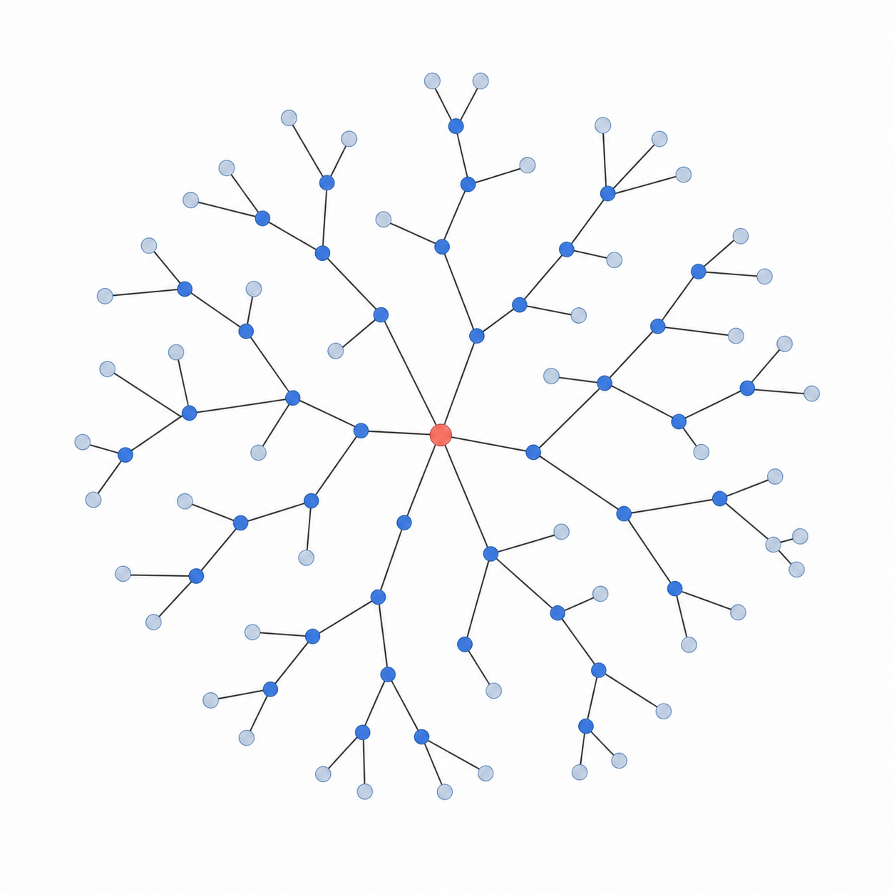
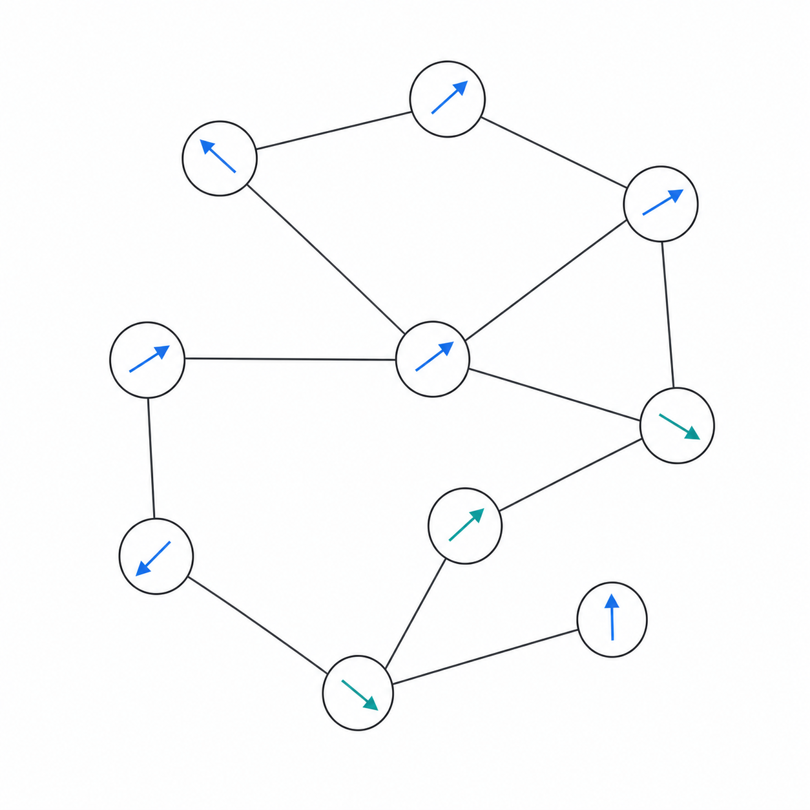
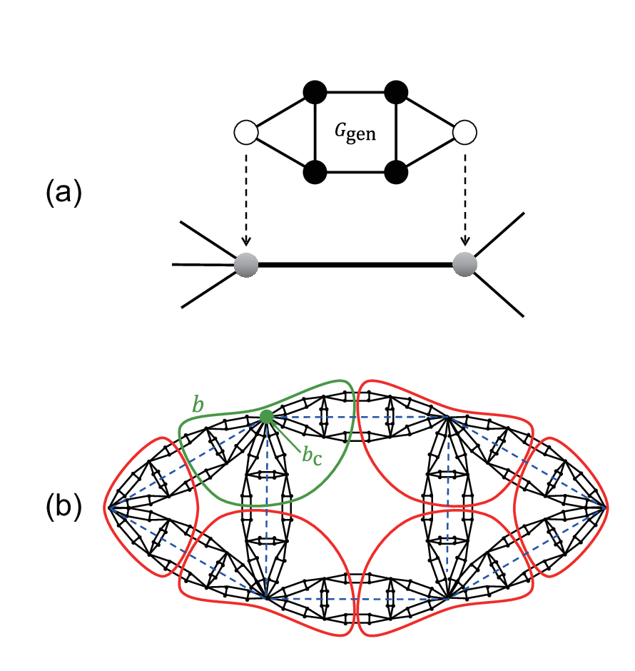
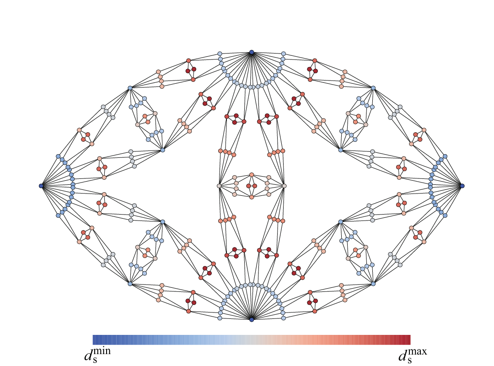
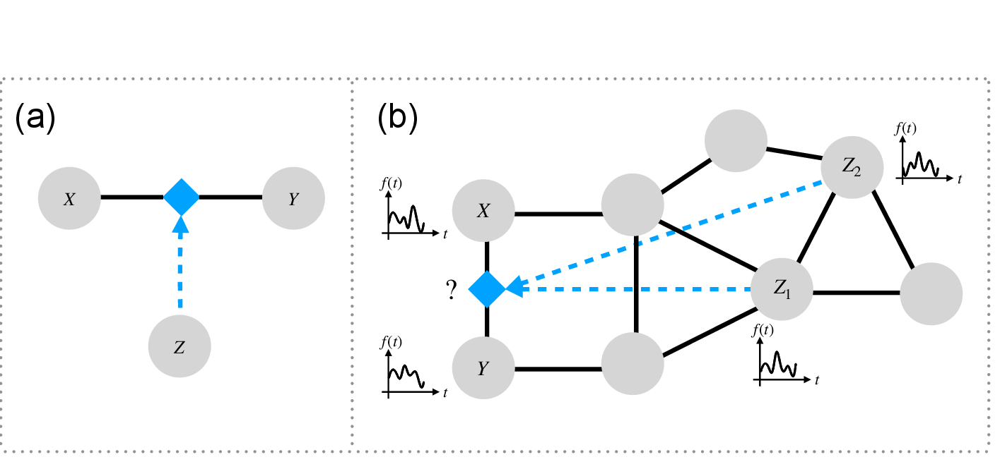

::: {.research-page}

## Current projects {#current-projects}

::: {.research-section-lead}
:::

::: {.research-program-grid}

:::: {.research-program-card}
::: {.research-program-card__visual}
<figure class="research-figure">
  
  <figcaption>A three-dimensional porous medium as a physical network.</figcaption>
</figure>
:::

::: {.research-program-card__body}

01Physical structure · spectral theory · dynamics

### Physical networks {#physnets}

How physical constraints impact network structure and dynamics, including how degree-volume disorder controls Laplacian eigenmode localization [@yamamoto2026localization; @yamamoto2026laplacian].

Current focusLaplacian eigenmode localization, diffusion, synchronization

:::
::::

:::: {.research-program-card}
::: {.research-program-card__visual}
<figure class="research-figure">
  
  <figcaption>A branching tree with heterogeneous branching.</figcaption>
</figure>
:::

::: {.research-program-card__body}

02Scaling theory · criticality · hierarchy

### Scaling theory for networks {#netscale}

Scaling laws and critical phenomena for networks with heterogeneous topologies [@yamamoto2023bifractality; @yakubo2024random].

Current focusCrossover · percolation criticality

:::
::::

:::: {.research-program-card}
::: {.research-program-card__visual}
<figure class="research-figure">
  
  <figcaption>Phase oscillators coupled through a network.</figcaption>
</figure>
:::

::: {.research-program-card__body}

03Nonlinear dynamics · experiments

### Network synchronization {#netsync}

How network structure and physical heterogeneity organize collective order in experimentally realized oscillator systems.

Current focusModular synchronization · spin oscillators

:::
::::

:::

## Past project {#past-project}

::: {.research-section-lead}
The completed projects are listed below. For a full list of publications, see the publications page.
:::

:::: {.research-project .research-project--reverse}
::: {.research-project__visual}
<figure class="research-figure">
  
  <figcaption>Generator construction and box covering used to analyze bifractality.</figcaption>
</figure>
:::

::: {.research-project__body}

PublishedPhysical Review E · 2023

### Bifractality of fractal scale-free networks {#bifractality}

Fractal scale-free networks can possess two local dimensions: one near hubs and another near ordinary nodes. Analytical and numerical results connect this bifractality to the combination of fractal geometry and a scale-free degree distribution [@yamamoto2023bifractality].

::: {.research-actions .research-actions--compact}
[Paper](https://doi.org/10.1103/PhysRevE.108.024302){.research-button .research-button--small}
[arXiv](https://doi.org/10.48550/arXiv.2304.13438){.research-button .research-button--small}
:::
:::
::::

:::: {.research-project}
::: {.research-project__visual}
<figure class="research-figure">
  
  <figcaption>Local spectral dimension across a bifractal network.</figcaption>
</figure>
:::

::: {.research-project__body}

PublishedPhysical Review E · 2024

### Random walks on bifractal networks {#bifractal-random-walks}

Building on bifractality, we showed that a random walk's walk dimension remains position-independent, whereas the spectral dimension splits into two local values.

The result connects static geometry to transport: local structural scaling remains visible in return probabilities even when the spreading exponent is global [@yakubo2024random].

::: {.research-actions .research-actions--compact}
[Paper](https://doi.org/10.1103/PhysRevE.110.064318){.research-button .research-button--small}
[arXiv](https://doi.org/10.48550/arXiv.2407.16183){.research-button .research-button--small}
:::
:::
::::

:::: {.research-project .research-project--reverse}
::: {.research-project__visual}
<figure class="research-figure">
  
  <figcaption>Structural and regulatory layers of a triadic-interaction network.</figcaption>
</figure>
:::

::: {.research-project__body}

PublishedNature Communications · 2025

### Inferring higher-order triadic interactions {#triadic-interactions}

This completed project used conditional correlations and mutual information to infer when a third node modulates an edge, then applied the framework to gene-regulatory networks [@niedostatek2025mining].

::: {.research-actions .research-actions--compact}
[Paper](https://doi.org/10.1038/s41467-025-66577-z){.research-button .research-button--small}
[arXiv](https://doi.org/10.48550/arXiv.2404.14997){.research-button .research-button--small}
[Code](https://github.com/anthbapt/trim){.research-button .research-button--small}
:::
:::
::::

:::
